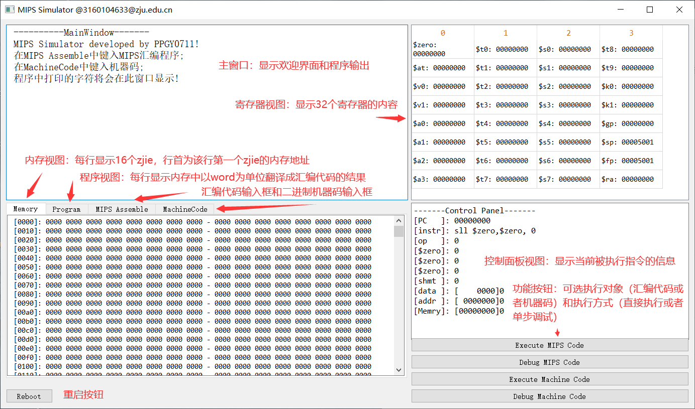
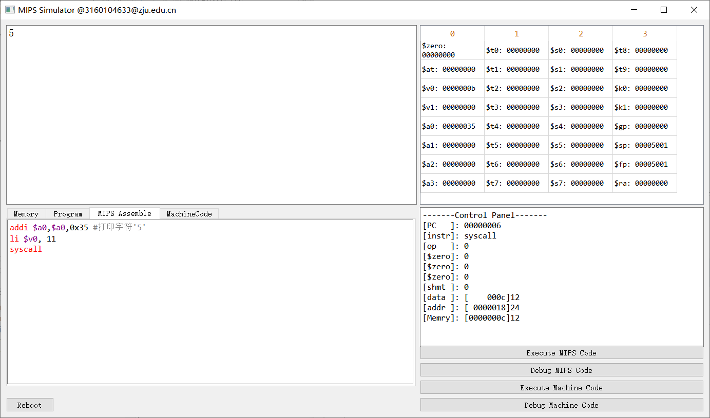
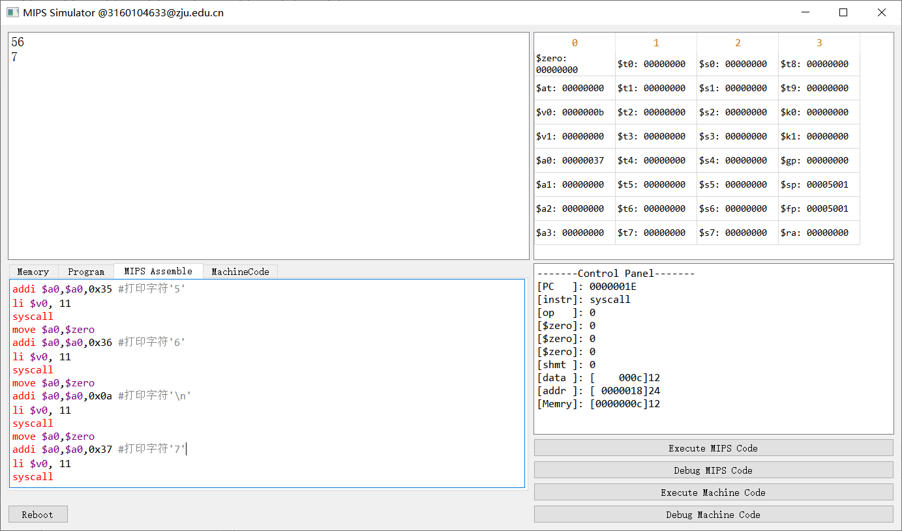

---
typora-copy-images-to:media
---

# MIPS模拟器

## 设计要求

以程序模拟MIPS运行，功能包括：

1、汇编器：输入汇编指令，转换成机器码模拟执行。

2、读入汇编好的机器码(二进制)，显示对应的汇编指令(反汇编)，并模拟执行。

**要求：**

1、模拟器运行界面设计：可以命令行或窗口界面。列表显示32个寄存器。

2、可执行多条指令。可观察寄存器、内存的变化。

## 使用工具及环境

### 语言

- C++


### 开发工具

- Qt Creator 5.9.0


### 电脑配置

- 操作系统环境：Windows 10 专业版64位
- 处理器：Intel(R) Core(TM) i7-6600U CPU @ 2.60GHz(4 CPUS), ~2.8GHz
- 内存：8192MB RAM

### 拟支持的架构

- 32位MIPS架构，RISC指令结构。CPU包含32个32位通用寄存器，包括一协处理器CP0，其中有EPC、CAUSE、STUTAS三个特殊寄存器。
- 存储器为32位寻址，以16位为最小寻址单位zjie，最大直接寻址范围为4Gx16位。32位数据寄存器按大头（Big-Endian）方式存取。

- 字符统一按16位存储，ASCii字符高8位补零，汉字字符按GB2312编码存储。


### 拟支持的指令集

#### 拟支持的常规指令集

| 序   | 指令    |  型  | 部件 | 指令格式          | op   | rs   | rt   | rd   | sa   | fun  |
| ---- | ------- | :--: | ---- | ----------------- | ---- | ---- | ---- | ---- | ---- | ---- |
| 1    | ADD     |  R   | ALU  | add   rd,rs,rt    | 0    | rs   | rt   | rd   | 0    | 32   |
| 2    | SUB     |  R   | ALU  | sub   rd,rs,rt    | 0    | rs   | rt   | rd   | 0    | 34   |
| 3    | SLT     |  R   | ALU  | slt   rd,rs,rt    | 0    | rs   | rt   | rd   | 0    | 42   |
| 4    | SLTU    |  R   | ALU  | sltu   rd,rs,rt   | 0    | rs   | rt   | rd   | 0    | 43   |
| 5    | AND     |  R   | ALU  | and   rd,rs,rt    | 0    | rs   | rt   | rd   | 0    | 36   |
| 6    | OR      |  R   | ALU  | or   rd,rs,rt     | 0    | rs   | rt   | rd   | 0    | 37   |
| 7    | XOR     |  R   | ALU  | xor   rd,rs,rt    | 0    | rs   | rt   | rd   | 0    | 38   |
| 8    | NOR     |  R   | ALU  | nor   rd,rs,rt    | 0    | rs   | rt   | rd   | 0    | 39   |
| 9    | SLL     |  R   | ALU  | sll   rd,rs,sa    | 0    | rs   | 0    | rd   | sa   | 0    |
| 10   | SLLV    |  R   | ALU  | sllv   rd,rs,rt   | 0    | rs   | rt   | rd   | 0    | 4    |
| 11   | SRL     |  R   | ALU  | srl   rd,rs,sa    | 0    | rs   | 0    | rd   | sa   | 2    |
| 12   | SRLV    |  R   | ALU  | srlv   rd,rs,rt   | 0    | rs   | rt   | rd   | 0    | 6    |
| 13   | SRA     |  R   | ALU  | sra   rd,rs,sa    | 0    | rs   | 0    | rd   | sa   | 3    |
| 14   | SRAV    |  R   | ALU  | srav   rd,rs,rt   | 0    | rs   | rt   | rd   | 0    | 7    |
| 15   | JR      |  R   | PC   | jr   rs           | 0    | rs   | 0    | 0    | 0    | 8    |
| 16   | JALR    |  R   | PC   | jalr   rs,rd      | 0    | rs   | 0    | rd   | 0    | 9    |
| 17   | MFC0    |  C   | SYS  | mfc0   rt,rc      | 16   | 0    | rt   | rc   | 0    | 0    |
| 18   | MTC0    |  C   | SYS  | mtc0   rt,rc      | 16   | 4    | rt   | rc   | 0    | 0    |
| 19   | ERET    |  C   | SYS  | eret              | 16   | 16   | 0    | 0    | 0    | 24   |
| 20   | SYSCALL |  R   | SYS  | syscall           | 0    | 0    | 0    | 0    | 0    | 12   |
| 21   | MUL     |  R   |      | mul   rd,rs,rt    | 28   | rs   | rt   | rd   | 0    | 2    |
| 22   | MULT    |  R   |      | mult   rs,rt      | 0    | rs   | rt   | 0    | 0    | 24   |
| 23   | MULTU   |  R   |      | multu   rs,rt     | 0    | rs   | rt   | 0    | 0    | 25   |
| 24   | DIV     |  R   |      | div   rs,rt       | 0    | rs   | rt   | 0    | 0    | 26   |
| 25   | DIVU    |  R   |      | divu   rs,rt      | 0    | rs   | rt   | 0    | 0    | 27   |
| 26   | MFHi    |  R   |      | mfhi   rd         | 0    | 0    | 0    | rd   | 0    | 16   |
| 27   | MFLo    |  R   |      | mflo   rd         | 0    | 0    | 0    | rd   | 0    | 17   |
| 28   | MTHi    |  R   |      | mthi   rs         | 0    | rs   | 0    | 0    | 0    | 18   |
| 29   | MTLo    |  R   |      | mtlo   rs         | 0    | rs   | 0    | 0    | 0    | 19   |
| 30   | LUI     |  I   | ALU  | lui   rt,dat      | 15   | 0    | rt   | dat  |      |      |
| 31   | ADDI    |  I   | ALU  | addi   rt,rs,dat  | 8    | rs   | rt   | dat  |      |      |
| 32   | SLTI    |  I   | ALU  | slti   rt,rs,dat  | 10   | rs   | rt   | dat  |      |      |
| 33   | SLTIU   |  I   | ALU  | sltiu   rt,rs,dat | 11   | rs   | rt   | dat  |      |      |
| 34   | ANDI    |  I   | ALU  | andi   rt,rs,dot  | 12   | rs   | rt   | dot  |      |      |
| 35   | ORI     |  I   | ALU  | ori   rt,rs,dot   | 13   | rs   | rt   | dot  |      |      |
| 36   | XORI    |  I   | ALU  | xori   rt,rs,dot  | 14   | rs   | rt   | dot  |      |      |
| 37   | LW      |  I   | MEM  | lw   rt,dat(rs)   | 35   | rs   | rt   | dat  |      |      |
| 38   | LWX     |  I   | MEM  | lwx   rt,dat(rs)  | 34   | rs   | rt   | dat  |      |      |
| 39   | LH      |  I   | MEM  | lh   rt,dat(rs)   | 33   | rs   | rt   | dat  |      |      |
| 40   | LHX     |  I   | MEM  | lhx   rt,dat(rs)  | 32   | rs   | rt   | dat  |      |      |
| 41   | LHU     |  I   | MEM  | lhu   rt,dat(rs)  | 37   | rs   | rt   | dat  |      |      |
| 42   | LHUX    |  I   | MEM  | lhux   rt,dat(rs) | 36   | rs   | rt   | dat  |      |      |
| 43   | SW      |  I   | MEM  | sw   rt,dat(rs)   | 43   | rs   | rt   | dat  |      |      |
| 44   | SWX     |  I   | MEM  | swx   rt,dat(rs)  | 42   | rs   | rt   | dat  |      |      |
| 45   | SH      |  I   | MEM  | sh   rt,dat(rs)   | 41   | rs   | rt   | dat  |      |      |
| 46   | SHX     |  I   | MEM  | shx   rt,dat(rs)  | 40   | rs   | rt   | dat  |      |      |
| 47   | BEQ     |  I   | PC   | beq   rs,rt,ofs   | 4    | rs   | rt   | ofs  |      |      |
| 48   | BNE     |  I   | PC   | bne   rs,rt,ofs   | 5    | rs   | rt   | ofs  |      |      |
| 49   | BGEZAL  |  I   | PC   | Bgezal   rs,ofs   | 1    | rs   | 17   | ofs  |      |      |
| 50   | J       |  J   | PC   | j   adr           | 2    | adr  |      |      |      |      |
| 51   | JAL     |  J   | PC   | jal   adr         | 3    | adr  |      |      |      |      |

#### 拟支持的伪指令集

| 序   | 指令  | 功能     | 格式             | 展开                                                         |
| ---- | ----- | -------- | ---------------- | ------------------------------------------------------------ |
| 1    | PUSH  | 进栈     | push   %1,%2,…   | addi   $sp,$sp,-n*2<br/>sw   %1, 0($sp)  <br/>sw   %2, 2($sp)  <br/>… |
| 2    | POP   | 出栈     | pop   %1,%2,…    | lw   %1, 0($sp)<br/>lw   %2, 2($sp)<br/>…  <br/>addi   $sp,$sp, n*2 |
| 3    | MOVE  | 赋值     | move   %1,%2     | or   %1,%2,$zero                                             |
| 4    | SHI   | 写数     | shi   %1,%2(%3)  | addi   $at,$zero,%1   sh   $at, %2(%3)                       |
| 5    | SHIX  | 写数     | shix   %1,%2(%3) | addi   $at,$zero,%1   shx   $at, %2(%3)                      |
| 6    | INC   | 加一     | inc   %1         | addi   %1,%2,1                                               |
| 7    | DEC   | 减一     | dec   %1         | addi   %1,%2,-1                                              |
| 8    | ADDU  | 无符号加 | addu   %1,%2,%3  | add   %1,%2,%3                                               |
| 9    | ADDIU | 无立加   | addiu   %1,%2,%3 | add   %1,%2,%3                                               |
| 10   | SUBU  | 无符号减 | subu   %1,%2,%3  | sub   %1,%2,%3                                               |
| 11   | NOT   | 取反     | not   %1,%2      | nor   %1,%2,%2                                               |
| 12   | NEG   | 取负     | neg   %1,%2      | sub   %1,$zero,%2                                            |
| 13   | ABS   | 绝对值   | abs   %1,%2      | sra   $at,%2,31<br/>xor   %1,%2,$at<br/>sub   %1,%1,$at      |
| 14   | SWAP  | 交换     | swap   %1,%2     | xor   %1,%1,%1<br/>xor   %2,%1,%2<br/>xor   %1,%1,%2         |
| 15   | B     | 转移     | b   %1           | beq   $zero,$zero,%1                                         |
| 16   | BEQZ  | 转移     | beqz   %1,%2     | beq   %1,$zero,%2                                            |
|      | li    | 立即数   | li %1,%2         | if(data<-32768\|\|data>32767){<br/>lui %1, HIGH %2<br/>ori %1,%1, LOW %2<br/>}<br/>else <br/>addi %1,$zero,%2 |
| 18   | la    | 取地址   | la %1,%2         | if(data<-32768\|\|data>32767{<br/>lui %1,HIGH %2<br/>ori %1,%1,LOW %2<br/>}<br/>else addi %1,%zero,%2 |

## 界面设计



## 功能点实现

### 汇编

在MIPS Assemble选项卡的输入框中可以输入MIPS汇编代码，提供基本的语法高亮功能，语言规范见“使用指南——语法规范”部分。

### 反汇编

在MachineCode选项卡的输入框中可以输入二进制机器码，同样可以接受以字符'#'开头的行注释，不支持跨行长注释。

### 模拟执行

提供两个按钮"Execute MIPS Code"和"Execute Machine Code"分别可以执行汇编代码输入的程序和二进制机器码输入的程序，结束后ControlPanel会显示最后一条被执行的指令信息，寄存器和主窗口会显示寄存器内容和程序的输出。

### 模拟调试

提供两个按钮"Debug MIPS Code"和"Debug Machine Code"分别可以单步调试汇编代码输入的程序和二进制机器码输入的程序，每执行一步寄存器和主窗口、控制面板会同步显示，调试结束前不能执行程序，暂未提供结束调试按钮，程序执行全部结束后ControlPanel会显示最后一条被执行的指令信息，寄存器和主窗口会显示寄存器内容和程序的完整输出。

### 重启

按下reboot按钮能够重启模拟器，回到欢迎界面和重置寄存器，在代码输入区仍保留上一次输入的代码或者机器码。

## 使用指南

### 语言规范

1. 语言区分大小写，所有关键字均为小写。

   1. 指令关键字
   2. 格式指令关键字
      1. 变量说明
      2. 格式说明
   3. 寄存器名
   4. 表达式操作符

2. 分隔符有：

   1. 空格' '，制表符'\t'——用于所有符号之间的间隔，可重复使用。
   2. 逗号','——用于操作数、变量之间的常数间隔
   3. 冒号':'——程序标号的表明标识。
   4. 井号'#'：注释标识符。

3. 每行指令一行

4. 标号需要与指令同一行。

5. 每个程序只能在一个文件中。暂无连接。

6. 支持格式指令与变量名定义。

   1. 格式指令集

      | 格式变量 | 功能       | 用法              | 说明                             |
      | -------- | ---------- | ----------------- | -------------------------------- |
      | equ      | 符号常量   | ```符号 equ xx``` | 定义符号常量                     |
      | .origin  | 起始地址   | ```.origin adr``` | 设置汇编程序绝对地址             |
      | .data    | 数据段     | .data             | 数据段                           |
      | .text    | 代码段     | .text             | 代码段                           |
      | .end     | 程序结束   | .end              | 系统程序结束                     |
      | .space   | 留空       | .space n          | 申请保留存储器空间，以zjie为单位 |
      | .zjie    | 16-bit字节 | 变量 .zjie xx     | zjie变量                         |
      | .2zjie   | 32-bit字节 | 变量 .2zjie xx    | 字变量32位                       |
      | .word    | 字32-bit   | 变量 .word xx     | 32位字变量                       |

   2. 特别说明在变量定义时，由于处理字符串能力问题，仅支持使用单引号''包含字符串，如以下实例。

      ```assembly
      #字符串变量定义
      Str .zjie '你好'
      ```

   3. 变量名定义规范同C语言标识符定义规范，区分大小写。

7. 所支持的MIPS关键字

   1. 寄存器：

      ```assembly
      #1.通用寄存器
      $zero, $at, $v0, $v1, $a0, $a1, $a2, $a3, 
      $t0, $t1, $t2, $t3, $t4, $t5, $t6, $t7, 
      $s0, $s1, $s2, $s3, $s4, $s5, $s6, $s7, 
      $t8,  $t9, $k0, $k1, $gp, $sp, $fp, $ra
      #可用数字格式$0-$31
      
      #协处理器寄存器
      "STATUS","CAUSE","EPC"
      ```

   2. 所支持的指令集（包含操作符）：见上两个表格。

### 系统调用功能说明

暂时仅支持一个系统调用功能print_char，中断号为11，均使用软件模拟，非MIPS代码实现。

使用示例如下：

#### 打印字符'5'

```assembly
addi $a0,$a0,0x35 #打印字符'5'
li $v0, 11
syscall
```

结果如下：

#### 打印换行和数字字符

```assembly
addi $a0,$a0,0x35 #打印字符'5'
li $v0, 11
syscall
move $a0,$zero
addi $a0,$a0,0x36 #打印字符'6'
li $v0, 11
syscall
move $a0,$zero
addi $a0,$a0,0x0a #打印字符'\n'
li $v0, 11
syscall
move $a0,$zero
addi $a0,$a0,0x37 #打印字符'7'
li $v0, 11
syscall
```

结果如下：

### 内存设计说明

- 程序以zijie寻址，每条指令2zjie，支持MIPS编译器
- 总内存：0x4000zjie;   #16384
- 显存：0x3000zjie;       #0x1000[4096zjie]
- 堆栈：$sp,$gp初始化为0x5001，堆栈从0x4000zjie开始，共0x1000[4096]zjie，使用时地址从高位向低位变化。

## 参考资料

- 《ZPC之MIPS指令集2019》
- 《计算机组成与设计——硬件软件接口》原书第五版，机械工程出版社

## 心得体会

### 硬件模拟困难

本次的设计是在之前Qt开发的MIPS汇编器的基础上开发的，开发过程中也发现了之前的设计当中还存在一些问题，比如协处理器指令没有与R类型指令分开，伪指令处理当中的标号添加问题等。在这一次的设计当中，由于最终是要显示在窗口，为了读程序方便，去掉了标号，直接显示成数字。

在对内存、中断等硬件实现的模拟方面，遇到了比较多的困难，需要对硬件的功能加以熟悉和理解。比如中断机制等的实现，在这一次的编码实现过程当中由于自己设计上的缺陷，没能通过交互界面模拟实现更多的中断，这一点比较遗憾，今后有时间会继续改进。

### 字符编码转换

在使用Qt开发的过程中，在字符串的编码转换方面遇到了一些困难，比如在dev c++中逐个打印字符串中字符的编码，发现中文字符对应的是GBK编码，刚好能用16位无符号短整数存储，但是在Qt当中直接打印string类型的变量，大部分都是乱码；通过逐个打印字符编码看出，汉字在Qt的string当中默认使用的utf8编码而不是GBK，一个汉字使用3个Byte，即24位编码，这样导致了如果直接把string类型转化成QString通过窗口控件输出，汉字都是乱码。最后不得不使用了两次编码转换才解决乱码的问题。

### 异常判断困难

这次的设计当中，在异常处理方面的管理可能比较弱，因为汇编代码是自己输入的，当输入错误代码的时候，有太多的地方可能存在错误导致程序异常退出，这一点在今后的改进当中需要解决。
